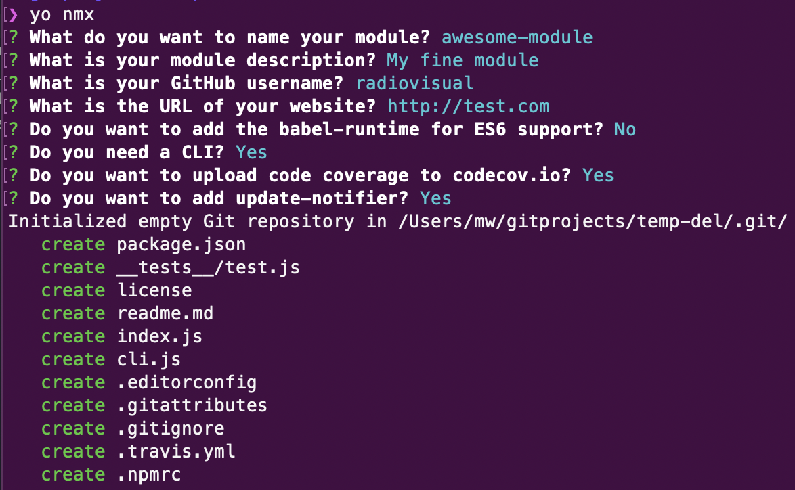

# generator-nmx [](https://github.com/radiovisual/generator-nmx/actions/workflows/main.yml)

> Scaffold out a node module with jest.

This generator is based off of [this awesome node module generator](https://github.com/sindresorhus/generator-nm), with some key changes.



## Install

```
$ npm install --global generator-nmx
```

## Usage

With [yo](https://github.com/yeoman/yo):

```
$ yo nmx
```

> [!TIP]
> Use [chalk](https://github.com/sindresorhus/chalk) if you want colors in your CLI.

---

:rainbow: :heart:
